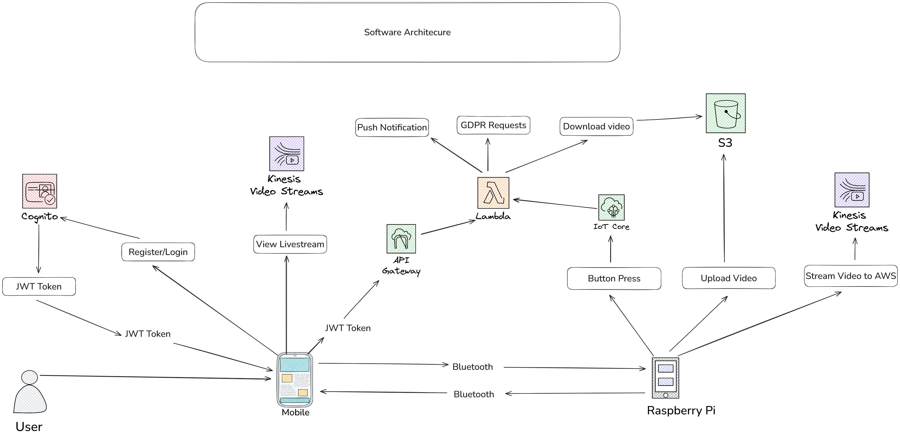

# Final-Year-Project
ET4927 - Final Year Project

## Project Title 
Designing a Cyber Resilient Smart Doorbell with GDPR Compliance 

## Project Goals

Build a smart doorbell using a raspberry pi. 
- The doorbell must be compliant with the Cyber Resilience Act and with GDPR. 
- Use AWS Cloud platform to facilitate the camera streaming, account management and GDPR requests
- Create a companion Android application to allow a user to signup to their account, login, view the camera livestream, download previous videos from doorbell and submit GDPR requests (account deletion, download data etc)

## Project Diagrams 

